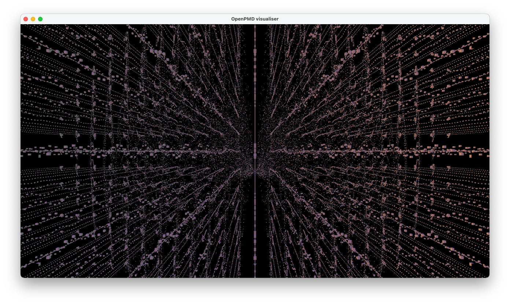

# scenery-OpenPMD interop

## Synopsis

This repository serves as a proof of concept for interfacing scenery and OpenPMD,
via OpenPMD's Python bindings, and [jpype](https://jpype.readthedocs.io/en/latest/index.html)/[scyjava](https://github.com/scijava/scyjava).

The code in `scenery-openpmd.py` loads data from the OpenPMD example files and displays
them using a custom scenery application that is fully defined in the Python code.



## Installation

Using conda or mamba, create a new environment by importing the provided `environment.yml` file,
```bash
conda env import -f environment.yml
conda activate scenery-python
```

You can then launch the PoC with `python ./scenery-openpmd.py`.
